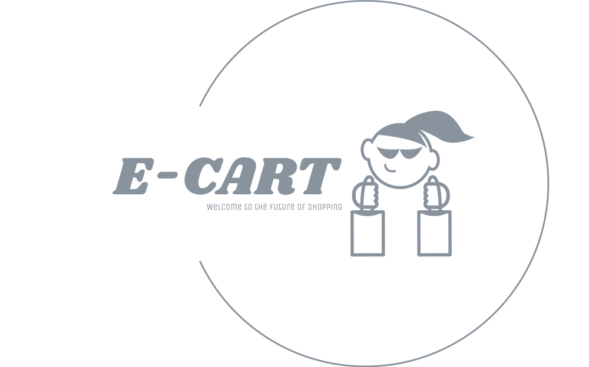

<h1 align="center">E-Cart</h1>

<p align="center"></p>

The E-Cart Application is a modern and versatile e-commerce platform built using the MERN stack, which stands for MongoDB, Express.js, React, and Node.js. This comprehensive e-cart solution is designed to provide a seamless and enjoyable online shopping experience for customers while offering a robust set of tools for store owners to manage their products and orders efficiently.

## Technology Stack
- **Frontend**: React, Redux (for state management), tailwindcss (for styling)
- **Backend**: Node.js, Express.js
- **Database**: MongoDB
- **Authentication**: JWT (JSON Web Tokens)
<!-- - Payment Processing: Integration with popular payment gateways (e.g., Stripe, PayPal)
- Deployment: Github pages
 -->
## Features
- User-friendly shopping cart interface.
- Secure user authentication and account management.
- Product catalog with search and filtering options.
- Add, remove, and update items in the cart.
- Order history and tracking for customers.
- Admin dashboard for product and order management.
- Inventory tracking and low-stock alerts.
- `Responsive design for mobile and desktop`.
<!-- - Analytics and reporting tools. -->
<!-- - Checkout and payment processing (integrates with common payment gateways). -->

## Getting Started

### Prerequisites

Before you begin, ensure you have met the following requirements:

- Node.js installed (version >= 12)
- npm or yarn package manager
- Database system (i.e Mongodb)

### Installation

To install and run the E-Cart Application, follow these steps:

1. Clone the repository:

   ```shell
   https://github.com/sailesh307/e-cart.git
    ```
2. Install the dependencies for [frontend](./frontend/) and [backend](./backend):

   ```shell
   cd frontend
   yarn install
   ```
   ```shell
   cd backend
   yarn install
   ```
3. Follow the other instructions in the [Frontend README](./frontend/README.md) and [Backend README](./backend/README.md) files for the frontend and backend respectively.


<h3 align="center">  Welcome to the future of shopping 🛒 🎉🛍️ </h3>
